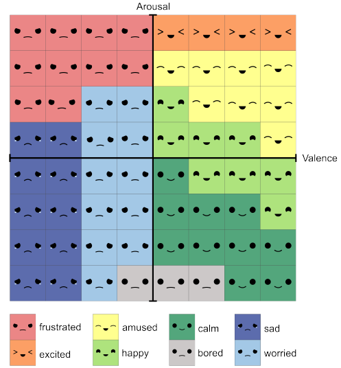

# What is my purpose? 

This web application was created so that RICBOT can have emotions and display them to the visitors during the tour. This aims to make RICBOT more human-like and thus boost his "acceptance" among humans. 

RICBOT has nine different emotions:
- amused
- bored
- calm
- excited
- frustrated
- happy
- sad
- worried
- thinking

The first eight emotions are based on the previous iteration of the HelloRIC project and were adapted for our iteration. The table created then can be seen in the image below. We added the thinking emotion for user feedback purposes. Whenever the LLM starts to generate the output for RICBOT we display the thinking emotion. That way, the user gets feedback that something is happening and does not think the robot froze. 

The current emotion can be selected in two ways. Either by selecting it directly or by calculating it based on the two values `arousal` and `valence`. `arousal` and `valence` both have a range from -4 to 3. 0 being on the top of the x-aches. The emotion is then selected depending on the value combination seen above.

Depending on the social context, the LLM behind RICBOT's speech adjusts the emotion RICBOT is currently feeling to influence the output of the LLM. The LLM then sends a ROS Message to the emotion system to update the displayed emotion. In this version, no calculation is necessary to display an emotion. We had to cut this feature due to manpower issues, but we left everything we already did in the project itself. Feel free to reuse it and expand the UI with it :)